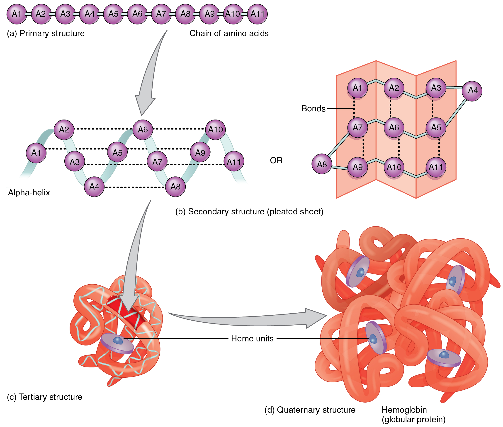
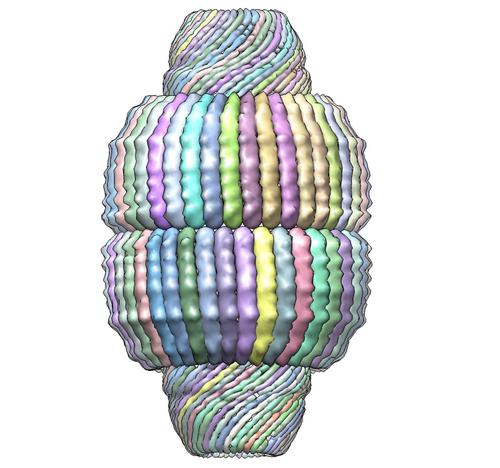

<meta charset='utf-8'/>

# Mika's question about biology

> "Could you explain what nucleolus, genes, chlorophyll, vaults, centrosomes,
> enzymes, lipeds, amino acids, lysosomes and nucleic acids are [plant cell
> parts]? I tried to google it but it didn't make much sense. Thank you. 🦉🦉

Okay, so I hope you won't be upset with me if I don't just go down the list
and define each thing, like a dictionary. There's a larger story here that
all these things fit into. Just like a book, if you know the story, it's
much easier to remember the characters than if you just read a list of their
names and descriptions.

## Catalysts and enzymes

The big story here is that a cell is a machine (a beautiful, incredibly
complicated and subtle one) for doing chemical jobs, rearranging atoms into
different shapes that are useful to the organism.

For example, did you know that wood, sugar (like sap), and starch (like rice)
are all made of the same atoms, which are the same atoms as air and water?
(Carbon, oxygen, and hydrogen, mostly.) All the plant does is _rearrange_ the
atoms of air and water (and a bit of stuff from the ground) to make its trunk,
its leaves, its seeds, and so on.

So when you see a forest, that's all just air and water, gathered up by
plants and turned into their bodies. This is literally, physically true, not
just a figure of speech or a point of view. I always feel a little awe when
I think about that.

But if wood is just made out of air and water, why don't air and water just
occasionally mix together to make bits of wood by accident? Why is it only trees
that make wood, and only rice plants that makes starchy grains of rice, etc.?

The answer is, these things _do_ happen by accident --- just VERY, VERY, VERY rarely.

Fortunately, it's possible to build a tiny machine, itself made of atoms, that
provides a mold that grips other atoms and then plugs them together in the right
shape, and then lets them go. Or, you could build another machine that takes
them apart. Adding one of these machines to a mix of the right kinds of atoms
can make the process go thousands, millions, or billions of times faster.

Atomic machines like this, that help some other chemical reaction go faster, are
called *catalysts*. By definition, a catalyst is _not_ used up as it does its
work! Once it's done, it pops off and is ready to do it again. When it's used by
a living thing, a catalyst is called an *enzyme*.

So that's your first definition: An *enzyme* is a *catalyst*, an atomic machine,
that a living organism uses to help a reaction (like building sugar or cellulose
(wood) from air and water) go faster. The enzyme doesn't get used up; it just
helps form the atoms into the right shape, and then it's ready to go again.

When you think about it, making a reaction that's normally very slow go a
million times faster is effectively the same thing as just turning it on and
off. If the enzyme is there, it happens; if the enzyme is absent, then it goes
so slowly you can ignore it. This means that, by adding and removing enzymes, a
cell can turn particular chemical reactions on and off.

## Amino acids and proteins {.pagebreak}

<figure>
  
  <figcaption>Author: OpenStax College</figcaption>
</figure>

Even though enzymes need to have an endless variety of shapes, to attract the
atoms they need and then click them together, it turns out that you can make
every kind of enzyme you could possibly need simply by chaining together
twenty-one different kinds of parts. These twenty-one parts are called *amino
acids*. There are nine you can only get by eating them; the other twelve your
body can make itself from other materials.

Amino acids are even simpler than legos, because they only connect in a chain.
Some amino acids are 'hydrophilic', meaning they are attracted to water, and
others are 'hydrophobic', meaning they're repelled by water. Since cells are
mostly filled with water, if you take your simple chain of amino acids and stick
it into the cell, it goes “sproing” and curls up into some shape that hides the
hydrophobic parts on the inside, with the hydrophilic parts on the outside. The
chain is specially chosen so that this process of curling up kinks it into the
right shape to function as an enzyme. Specific amino acids know how to attract,
grab, and release atoms to build (or tear down) whatever the cell needs, so the
protein has to arrange those in the right shape, and it will be ready to work.

This is too amazing to really believe: everything you see in nature is built by
enzymes that are chains of only twenty-one different kinds of parts, shaped by
carefully choosing the sequence, and then dropping them into water.

A chain of amino acids is called a *protein*. So, pulling the terms together: An
*enzyme* is a *protein*, a chain of *amino acids*, acting as a *catalyst* in a
living thing. (I think there might be enzymes that are not proteins, but I think
that's rare.)

You probably already know the word protein from food: “Eggs are a good source of
protein.” What that means is that the food has a variety of the amino acids you
need. Probably the egg was going to use them to grow a chick, but your stomach
and intestines can break apart the egg's proteins and put their amino acids to
work building you instead.

## Nucleic acids and genes

If you just throw together a chain of amino acids to make a random protein, you
are not going to get anything useful. It'll just be a clump that tumbles around
until something in the cell takes it apart and recycles its amino acids into
something else. So how does a cell know how to build useful proteins?

Someone might say, “Well, I know how to build things in a cell! If I need an
enzyme, I'll just build it with another enzyme!”

This sounds like a dumb idea: how would you build _that_ enzyme? But as it turns
out, this is exactly what happens. Cells have one enzyme, called a *ribosome*,
whose job is to build all the other enzymes. Since enzymes are proteins—chains
of amino acids—building any enzyme is just a matter of gathering the right amino
acids and chaining them together in the right order, and then dumping them into
the water of the cell body, where they sproing into the right shape.

A ribosome can build any enzyme you want, if you just tell it the right sequence
of amino acids to assemble. This is why it's practical to build enzymes with
other enzymes: you have one flexible, general-purpose enzyme that can build
anything else. It's a little bit like how you can have one computer that runs
whatever software you give it: the computer can follow instructions, and the
software instructs it to do something useful.

But how do you tell a ribosome the right sequence of amino acids to hook up?
Biology has another kind of little part that can be chained together with
itself, called a *nucleic acid*. There are only five different nucleic acids,
but once you've formed them into a chain, it can zip up very nicely with a
reversed copy of itself to make a spiral (biology calls it a “helix”), which not
only protects the chain but makes it easy to unzip and copy when you need it. A
ribosome knows how to take a chain of nucleic acids and “read” it as if it were
a code describing the sequence of amino acids it should chain together to make a
protein. A sequence of nucleic acids that tells a ribosome how to build a
protein is called a *gene*.

Cells actually keep their genes all connected together in one very, very long
chain (in humans, hundreds of millions of nucleic acids long), with special
patterns to mark where each gene starts and ends. When the cell needs to make an
enzyme, it uses the marker patterns to find the section of the long chain that
holds the right gene, unzips the chain there, makes a copy, and then feeds that
little chain of nucleic acids to a ribosome, which gathers up the right amino
acids to build the protein that is the requested enzyme.

Note that there are two separate kinds of chains here: nucleic acids chain
together to make genes, and amino acids chain together to make proteins. A gene
describes the sequence of amino acids that the ribosome must assemble to make a
protein, so the protein can serve as an enzyme in the cell to build whatever it
wants.

Summary: Cells keep long chains of *nucleic acids*, sections of which are
*genes* that tell a ribosome how to chain together *amino acids* to make
*proteins* that serve as *enzymes*.

## Lipids and membranes

<figure>
  
  <figcaption>Author: Mariana Ruiz Villarreal</figcaption>
</figure>

So, in addition to genes (chains of nucleic acids) and proteins (chains of amino
acids), there is yet another kind of chain that cells love to use. A single
amino acid is made from around ten or twenty atoms, and a nucleic acid is around
twenty to thirty atoms, but you can make much simpler chains out of individual
atoms. A *lipid* of the sort you're talking about in class is a chain made from
a “head” at one end, and a long “tail” of carbon atoms with a fringe of hydrogen
atoms on each side.

What's interesting about a lipid is that the “head” is hydrophilic (attracted to
water), but the “tail” is hydrophobic (repelled by water). This means that if
you dump a bunch of lipids into water, they'll naturally form themselves into a
ball, with the tails on the inside and the heads facing outwards. Now, if you
make the ball really big, it will flatten out into a sheet, with the heads
lining the top and bottom surfaces of the sheet and the tails inside the
thickness of the sheet. The edges of these sheets have the tails exposed, so
they don't like that much; one way to fix that is to join up with the other edge
of the sheet to make a hollow ball: a drop of water inside, carefully surrounded
by a sheet of lipids, and then more water on the outside. Now this arrangement
can get very large without breaking, since all the tails are nicely hidden in
the thickness of the membrane, and you can make the drop of water as large as
you need to fill the sheet. If something breaks the sheet, that exposes the
tails, and the sheet will naturally repair itself simply because of the way the
hydrophilic heads and hydrophobic tails act in water.

Such a sheet of lipids is called a *membrane*. The membrane of an animal cell is
a double layer of lipids like this. A plant cell builds a harder *cell wall*
outside the membrane, to protect the cell and make it stiff. Some large enzymes
are designed so that their middles are attracted to the lipid tails, and their
ends are attracted to water, so they like to sit themselves right across a lipid
membrane, with one end sticking out on each side. The genes build such proteins
to move things across the membrane, like food, oxygen, waste products, and lots
of other things. The animal cells that can swim with a tail attach their tail to
a giant “motor” protein that sticks through the cell membrane, and uses the
energy stored inside the cell to move the tail on the outside.

In the food you eat, fats are lipids. Butter is milk fat, lipids a cow makes to
feed its calf. Hamburger grease is the fat present in a cow's muscles, melted.
(I don't know why muscles need to have fat in them.) But plants make fat, too:
cooking oil is made from a grain called 'canola', and avocados are creamy
because of the fat their flesh contains. Anything oily or fatty is probably a
lipid.

## The nucleolus

I've sketched out a simple story of how to get things done in a cell: the
sequence of nucleic acids in a gene tells a ribosome how to build a protein,
which is released into the cell to do its work.

But biology never does anything the simple way. Some of the more complicated
enzymes actually take many steps to build: first the cell builds specialized
tool enzymes, and then it uses those tools to prepare the raw materials or build
other tools, and then finally it puts everything together.

In particular, ribosomes themselves are incredibly complex. They have two main
parts, each of which consists of a skeleton of nucleic acids, of which each of
those is surrounded by a shell of proteins. (I never mentioned that nucleic
acids can be part of enzymes, too! It's not common.) Building a ribosome,
Wikipedia tells me, involves over 200 different proteins serving as tools and
helpers!

The *nucleolus* is the part of the cell that gathers together all the necessary
actors and ingredients and manufactures new ribosomes.

## Chlorophyll

Suppose you wind up a music box, and then let it play. When you wind the box,
you are using your strength to tighten a spring, which stores the energy from
your hand. When you let the box play, the spring releases its energy as it
uncurls, and the mechanism uses that energy to pluck the notes.

Atoms can work like springs as well. Some arrangements of atoms are like tightly
wound springs: it takes force to connect the atoms that way, and if you give
them a chance, they will spring out into a more relaxed shape, and give up
energy as they do so.

Many enzymes need to take loose, unwound collections of atoms and squeeze them
into tightly wound shapes, with energy stored in them. But winding something up
requires force. How do the enzymes get the strength they need?

Well, one way to wind a spring up tight is to have another, bigger spring that
you unwind to provide the force you need! Many enzymes actually have *two* sides
that attach to atoms: on the one side, it attaches to a tightly-wound, powerful
molecule called *ATP*, and the other side, it attaches to the work it needs to
do. The enzyme lets the ATP unwind into a looser molecule called *ADP*, and that
gives it the strength it needs to do whatever its job is on the other side.

But then, who winds up the ATP in the first place? Mostly, cells do the same
trick of winding up one spring by unwinding another, bigger one! In this case,
the powerful spring is sugar: cells combine oxygen and sugar on one side
(combining anything with oxygen is called “burning” it, so we say that cells
“burn sugar”) and re-wind ADP back into ATP on the other side. The cell then
lets the ATP out for all the other enzymes to use. This process involves many
enzymes, but you can think of it simply as “oxygen, sugar, and ADP in; carbon
dioxide, water, and ATP out”.

But this still doesn't answer the question: where does the sugar come from??

Plant cells have a big collection of enzymes that work together to turn carbon
dioxide and water into sugar, using light to power the process. These enzymes
use *chlorophyll*, a pigment (like an ink or a paint component), to absorb the
light in just the right way so that the enzymes can use its energy. Once you
have sugar, you can produce ATP; and once you have ATP, you can do whatever you
want.

The nice thing about sugar is that it keeps well. You can store it for a long
time without it losing its energy. One thing plants often do is hook many, many
sugars together in a long chain, called a starch, and store it that way. (This
is the fourth kind of chain we've talked about! Biology loves chains!)

Summary: *chlorophyll* is a pigment that absorbs light, which plants use to
produce sugar from carbon dioxide and water.

Notice how many steps it takes for a plant to actually get anything done:

- First, it uses light to build high-energy sugar from low-energy carbon dioxide
  and water.

- Then, it burns sugar with oxygen to wind up ADP into ATP.

- Finally, it uses ATP to power the enzymes that actually do the job.

This is pretty typical in biology. In fact, even this list leaves out lots of
steps: the usual way to burn sugar to make ATP actually takes ten steps,
involving nine different enzymes.

## Centrosomes

Cells have simple skeletons made of tiny fibers. They use these skeletons not so
much to keep the shape of their body, the way an animal does, but to arrange
their parts when they need to divide for reproduction. Obviously, each side
needs its own copy of each part, so you have to apportion them out carefully;
the fibers help with this. These fibers are usually arranged all radiating out
from a single central anchor point called the *centrosome*.

## Lysosomes

A *lysosome* is a lipid membrane around a bubble of digestive enzymes. The cell
brings food materials from the outside world into its lysosomes, where the
enzymes break down the food into the raw materials the cell needs. For example,
if a single-celled animal catches another one, it will bring it into one of its
lysosomes, and use enzymes to break its proteins apart into individual amino
acids, which the animal can now use to build its own proteins.

<figure>
  
  <figcaption>Vault, by H. Tanaka, K. Kato, et al.</figcaption>
</figure>

You can think of the *lysosome* as the stomach or intestine of the cell.

## Vaults

Vaults are large collections of proteins. Nobody seems to know what they are
for. But they look cool.
